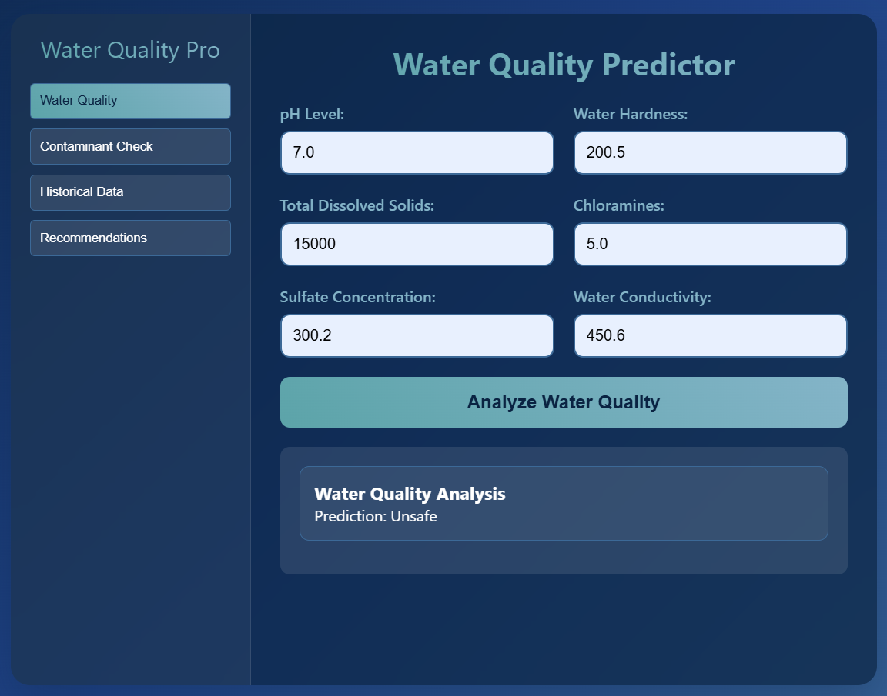
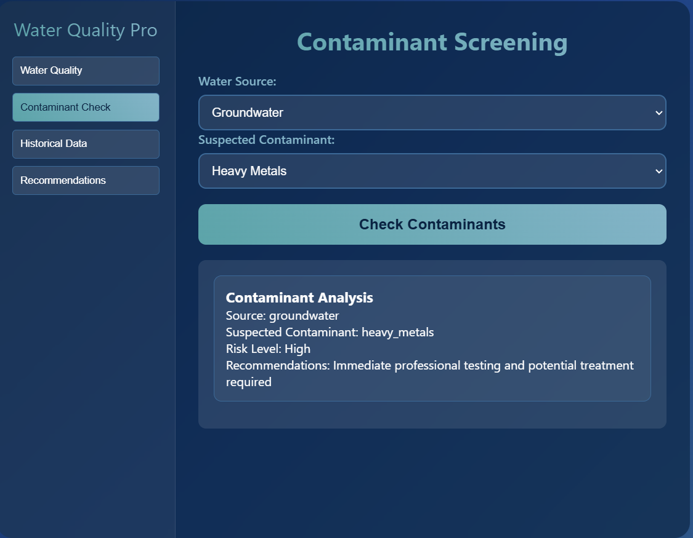
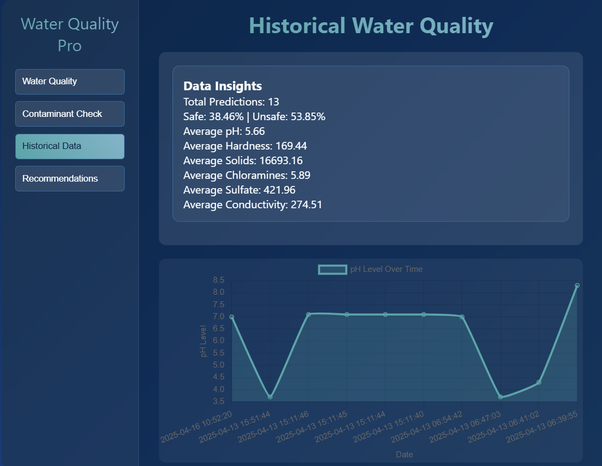

# 💧 Water Quality Predictor Pro

**Machine Learning-Driven Water Potability Prediction with a Django-Based Interactive Web Platform**

## 🧠 Abstract

This project presents an integrated ML + web platform that predicts whether water is **potable or not** using a dataset of physicochemical features. The system is deployed through a Django-based responsive application that provides **real-time predictions**, **contaminant checks**, **data visualizations**, and **recommendations**.

> ✅ Achieved up to **71% test accuracy** using Random Forest with SMOTE and RFE.

---

## 🚀 Features

- **Real-time potability prediction** using trained ML models
- **Contaminant check** aligned with WHO thresholds
- **Visualization of historical data** using Chart.js
- **Recommendation engine** based on predicted outcomes
- Responsive and accessible UI (Glassmorphism + WCAG 2.1)

---

## 📊 ML Pipeline Overview

### Dataset:
- **Samples:** 3,276 records
- **Features:** pH, Hardness, Solids, Chloramines, Sulfate, Conductivity, Organic Carbon, Trihalomethanes, Turbidity

### Preprocessing:
- Median imputation for missing values
- Z-score based outlier removal
- StandardScaler normalization
- Class balancing using **SMOTE**

### Feature Selection:
- **Recursive Feature Elimination (RFE)** retained 6 best features:
  - pH, Hardness, Chloramines, Sulfate, Conductivity, Turbidity

### Models Tested:
- Random Forest (best accuracy: **71%**)
- XGBoost
- Stacking
- SVM
- KNN
- Logistic Regression

### 📈 Results:

| Model            | Accuracy | Precision | Recall | F1-Score | AUC-ROC |
|------------------|----------|-----------|--------|----------|---------|
| Random Forest    | 0.71     | 0.72      | 0.70   | 0.71     | 0.78    |
| XGBoost          | 0.70     | 0.70      | 0.69   | 0.70     | 0.76    |
| Stacking         | 0.70     | 0.70      | 0.69   | 0.70     | 0.76    |

---

## 🧪 Application Preview

### 🔘 Input Interface

### 🚨 Contaminant Check

### 📉 Historical Trend Visualization (pH)

---

## ⚙️ Tech Stack

- **Frontend:** HTML, CSS (Glassmorphism), JavaScript
- **Backend:** Django (v4.2), SQLite
- **ML Libraries:** scikit-learn, imbalanced-learn, XGBoost
- **Visualization:** Chart.js

---

## 📌 Research Questions Addressed

- Can ML predict potability in noisy, imbalanced datasets?
- Which features influence predictions most?
- Can a Django app deliver secure, fast predictions?
- How scalable is this system for IoT/cloud-based deployments?

---

## 🔮 Future Enhancements

- Integrate IoT sensors for real-time data collection
- Use cloud computing for large-scale deployments
- Improve model with deep learning
- Enhance data privacy and ethical deployment

---

